# Proyecto Final simualcion Montecarlo
La simulación Monte Carlo es una técnica que se utiliza para evaluar 
el resultado de un proceso o sistema complejo mediante el uso de números aleatorios.
Esta técnica se llama así en honor a la ciudad de Monte Carlo en Mónaco, que es famosa por sus casinos 
y donde se utilizó por primera vez para analizar el comportamiento de los sistemas físicos.


## Instalacion

### Descargar e instalar Docker en su maquina
Por ejemplo instalar Docker desktop en Windows 10

- Descargar la aplicacion en el siguiente link
    - https://www.docker.com/products/docker-desktop/
- instalar Docker desde Powershell
    ```Powershell
    cd Downloads/
    "Docker Desktop Installer.exe" install
    Start-Process 'Docker Desktop Installer.exe' -Wait install
    ```
- Ejecutar la aplicaion de Docker
- Ejecutar el container con la aplicaion de Montecarlo
    ```Powershell
    Docker run -it eliecer1docker/monte_carlo:v1.1.1
    ```
    Esto descargara y ejecutara el conteiner de la aplicacion desde Docker Hub a la maquina local
    ademas de abrir una consola interactiva del contenedor para escoger las opciones del menu de la
    aplicacion

## 10 Ejemplos de simulacion Montecarlo

<table>
  <tr>
    <td>
        <div align="left">
        Ejemplo 1 Descompostura de una maquina<br>
        Enunciado<br>
        Supongamos que trabajamos con 30 maquinas y se desea estimar el nivel de servicio que puede dar 
        un mecánico a estas maquinas. Para esto se obtienen la frecuencia de fallas entre maquinas y el tiempo de servicio
        </div>
    </td>
  </tr>

  <tr>
    <td>
        <div class="imgs" align="center">
            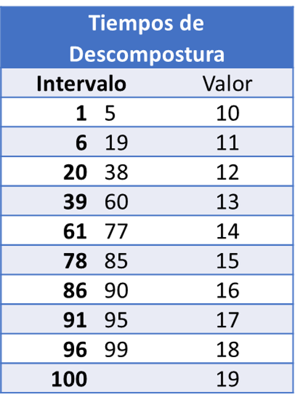
            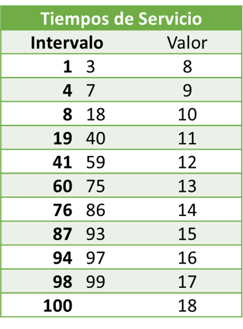
            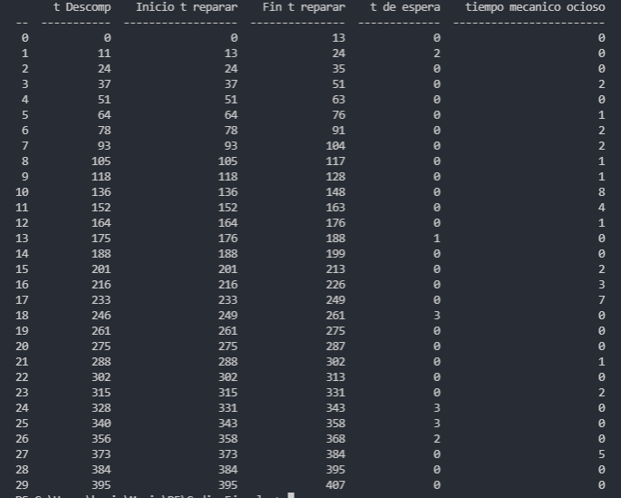
        </div>
    </td>
  </tr>

  <tr>
    <td>
        <div align="left">
            Ejemplo 2: Inventario<br>
            Enunciado<br>
            Supongamos que la demanda de cierto producto esta dada por la siguiente distribución
        </div>
    </td>
  </tr>
  <tr>
    <td>
        <div>
            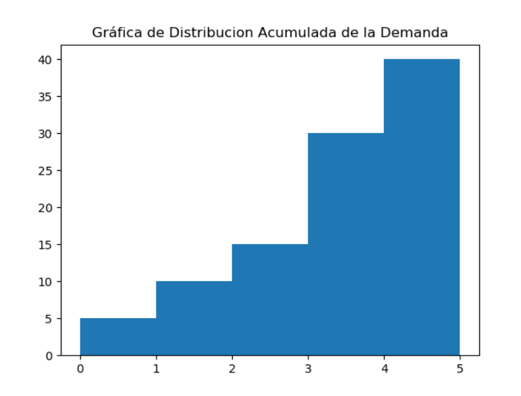
            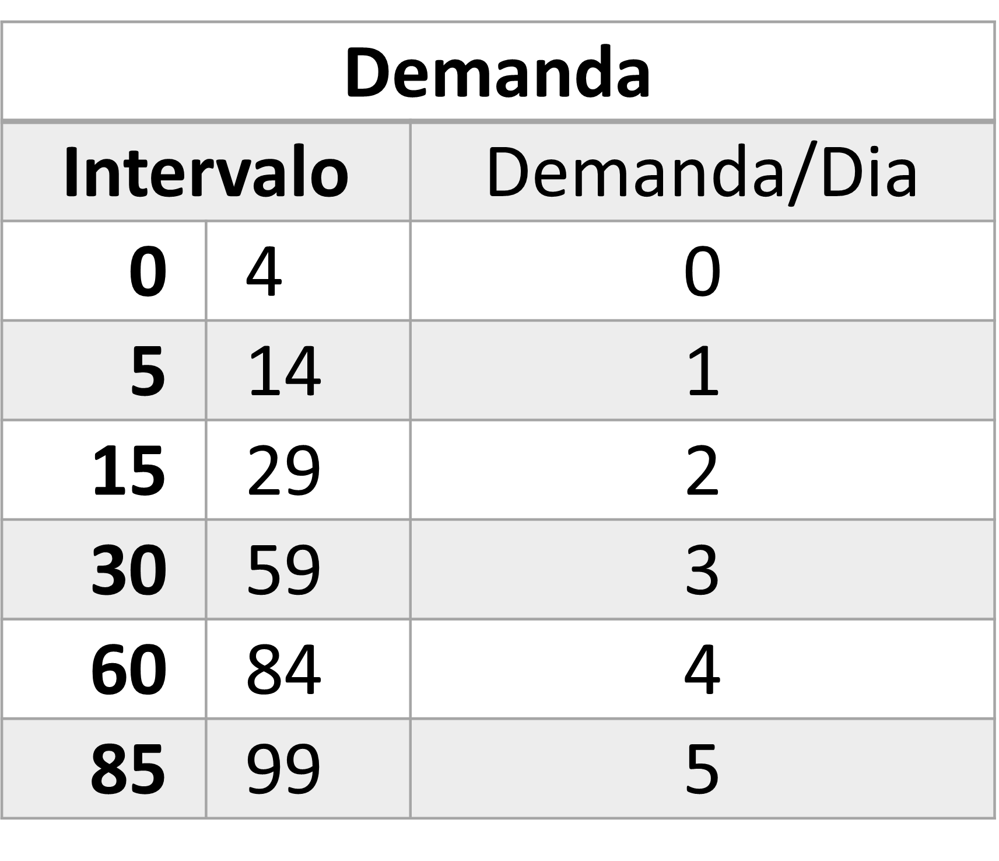
            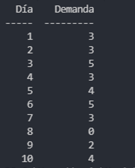
        </div>
    </td>
  </tr>
  <tr>
    <td>
        <div align="left">
            Ejemplo 3: Función de Efectividad<br>
            Enunciado<br>
            Supongamos que tenemos un sistema cuya función de efectividad esta representada por : 
            𝑤=𝑥+4𝑦+3𝑧
            Los valores de X, Y, y Z están dados por las siguientes tablas
        </div>
    </td>
  </tr>
  <tr>
    <td>
        <div>
            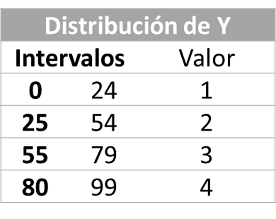
            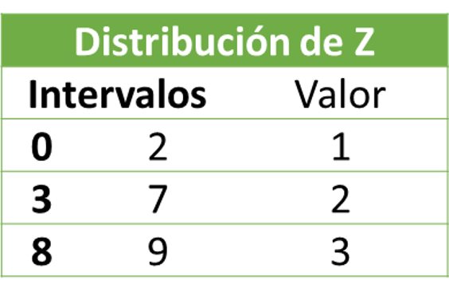
            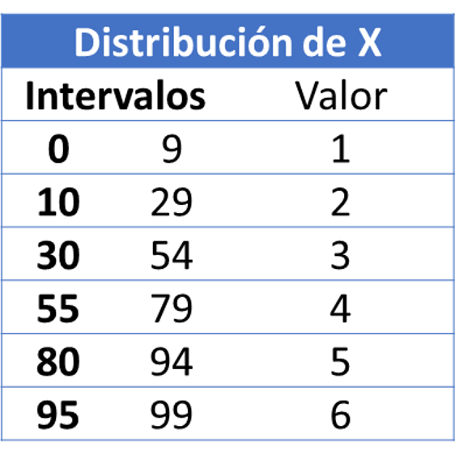
            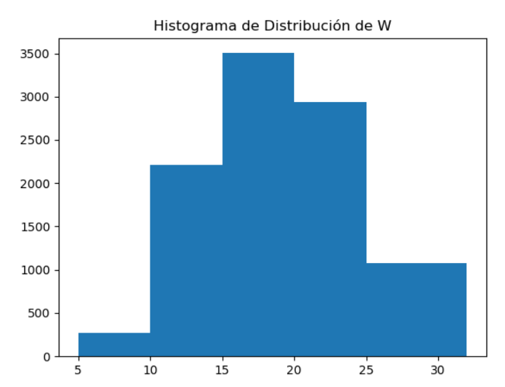
        </div>
    </td>
  </tr>
  <tr>
    <td>
        <div>
        Ejemplo 4: Calculo del Área Bajo la curva<br>
            Enunciado<br>
            Supongamos que queremos calcular el área bajo la siguiente función dentro de los limites A y B de -1 y 1 respectivamente. 
            𝑓(𝑥)=   sin⁡〖(𝜋𝑥)〗/𝜋𝑥
            La curva roja es nuestra f(x), la línea azul representa a A, la línea verde representa a B, y la línea morada representa el límite superior f(0). 
        </div>
    </td>
  </tr>
  <tr>
    <td>
    <div>
        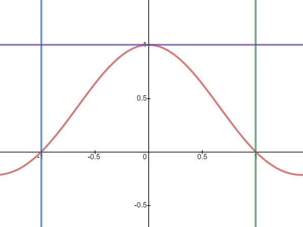
        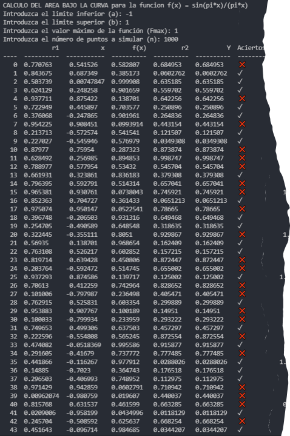
        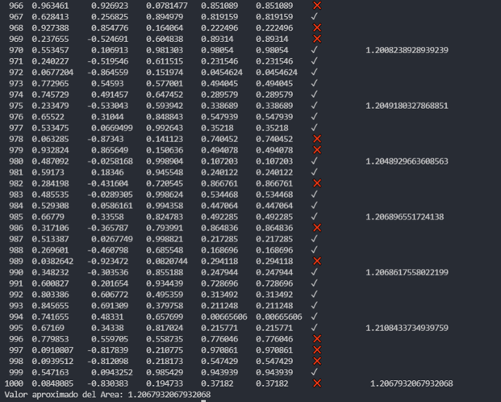
    </div>
    </td>
  </tr>
  <tr>
    <td>
        <div>
            Ejemplo 5: Calculo de Pi por el método de la aguja de Buffón<br>
            Enunciado<br>
            Este ejemplo es uno que demuestra el ingenio de la mente humana. Aquí, calcularemos el valor de la contante π por medio de la simulación utilizando el método de la Aguja de Buffon. 
        </div>
    </td>
  </tr>
  <tr>
    <td>
        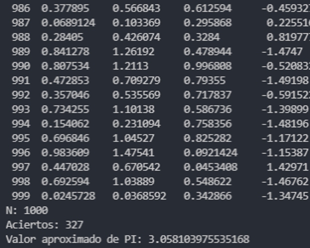
    </td>
  </tr>
    <tr>
    <td>
        <div>
            Ejemplo 6: El Tambaleo del Borracho<br>
            Enunciado<br>
            Supongamos que un borracho esta parado en una esquina de una calle cuando decide caminar para salir de su embriagues. 
            Asuma que hay igual probabilidad de que vaya hacia el norte, sur, este u oeste. Si camina 10 cuadras. ¿Cuál es la probabilidad de que termine a dos cuadras de donde inició?
            Designaremos una localización a cada esquina mediante coordenadas, donde X representa la dirección este-oeste y Y la dirección norte-sur. Cada vez que se mueva hacia el este incrementamos el valor de X y cada vez que se mueva hacia el oeste le restamos uno a X.  Se realiza un proceso semejante con el movimiento norte-sur. Si le asignamos a la posición inicial las coordenadas (0,0) podremos establecer una relación entre cualquier punto en el que se encuentre y la posición inicial. Si al terminar el recorrido de 10 manzanas la suma de los valores X y Y es mayor que 2 entonces nuestro borracho terminó a una distancia mayor de dos cuadras del punto inicial. Podemos representar su movimiento en un plano cartesiano, o bien en una matriz.
        </div>
    </td>
  </tr>
  <tr>
    <td>
        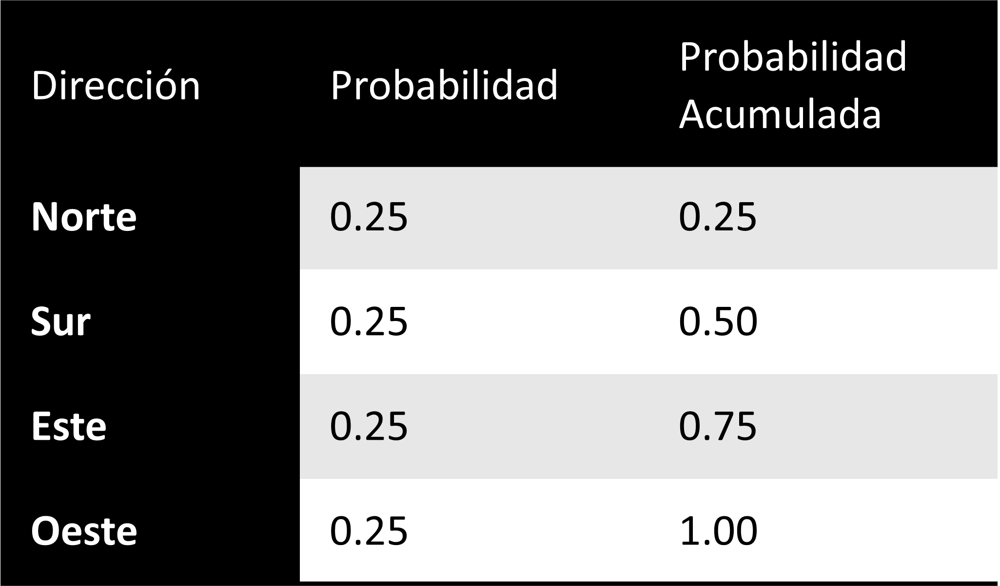
        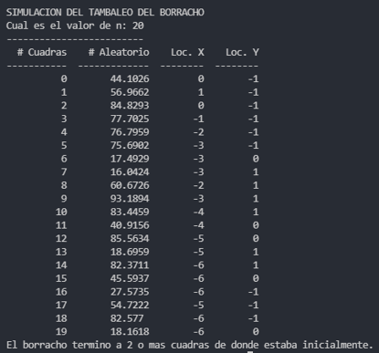
    </td>
  </tr>
    <tr>
    <td>
        <div>
            Ejemplo 7 Descompostura de una maquina<br>
            Enunciado<br>
            Se supone que la distribución empírica mostrada en la tabla de la siguiente diapositiva describe el tiempo entre llegadas a un canal simple de servicio y que el tiempo de servicio está distribuido exponencialmente. El problema consiste en determinar el tiempo medio de servicio de manera que el costo total del sistema sea mínimo, donde el costo total el sistema (CT) está dado por:
        </div>
    </td>
  </tr>
  <tr>
    <td>
        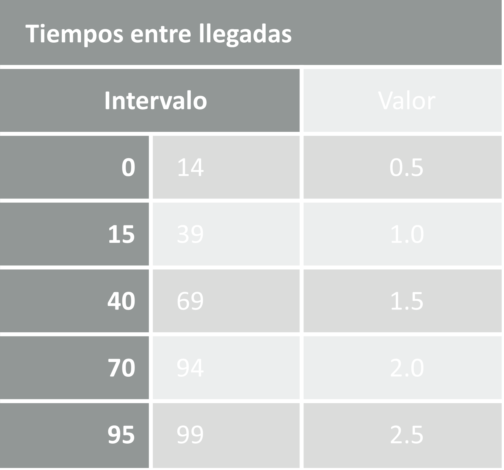
        
    </td>
  </tr>
    <tr>
    <td>
        <div>
            Ejemplo 8: Generación de una variable aleatoria exponencial<br>
            Enunciado<br>
            Supongamos que trabajamos con 30 maquinas y se desea estimar el nivel de servicio que puede dar 
            un mecánico a estas maquinas. Para esto se obtienen la frecuencia de fallas entre maquinas y el tiempo de servicio
        </div>
    </td>
  </tr>
  <tr>
    <td>
        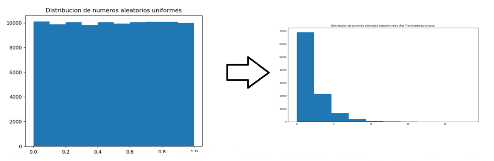
        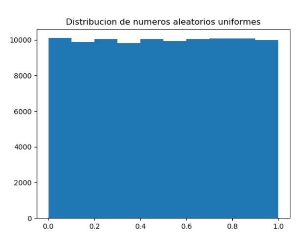
        
        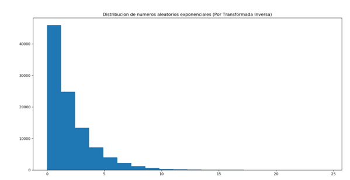
    </td>
  </tr>
    <tr>
    <td>
        <div>
            Ejemplo 9: Craps<br>
            Enunciado<br>
            En un juego de craps, tiramos dos dados y contamos la suma de sus valores. Hay tres escenarios que nos pueden llevar a una victoria o perdida. Estos son: 
            - Si la suma es igual a 7 o 11, se cuenta como una victoria. 
            - Si la suma es 2,3, o 12 (llamado un craps), se cuenta como una perdida.
            - De otro modo, tiramos el dado hasta que saquemos lo que habíamos tirado inicialmente y cuente como ganar. O saquemos - una suma que de 7 y cuente como perder. 
        </div>
    </td>
  </tr>
  <tr>
    <td>
        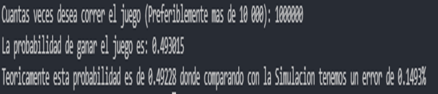
    </td>
  </tr>
    <tr>
    <td>
        <div>
            Ejemplo 10: Penney’s Game<br>
            Enunciado<br>
            Un n-grama es una serie de caracteres con longitud n. Con los lanzamientos de una moneda podemos formar n-gramas que utilice dos caracteres {H: cara (head), y T: sello (tail)}. 
            El juego que veremos se llama Penney’s game y se trata de que tenemos dos jugadores, cada uno escoge un 3-grama producido por las monedas (TTT, TTH, THT, THH, HTT, HTH, HHT o HHH). Entonces lanzamos una moneda n veces y el 3-grama del jugador que salga primero gana.
        </div>
    </td>
  </tr>
  <tr>
    <td>
        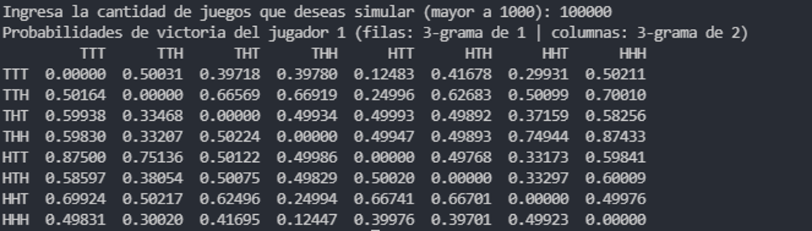
    </td>
  </tr>
</table>


## Autor

- [@EliecerAAguilar](https://www.github.com/elieceraaguilar)


